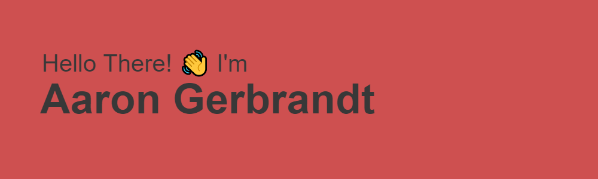

#### 🤵About Me!

I am currently a student at <a href="https://missouristate.edu">Missouri State University</a> in Springfield, MO. I will graduate in May 2023 with a Bachelor's of Science in Computer Science and a Minor in Mathematics!

---

#### 💾 I love using ...
**Python**
**C**#
**Java**
**JavaScript**

---

#### 🌱 I’m currently learning ...
**Kotlin**
**Android Development**
🧪&nbsp;**Quality Assurance & Testing**

<!--
**aarongerbrandt/aarongerbrandt** is a ✨ _special_ ✨ repository because its `README.md` (this file) appears on your GitHub profile.

Here are some ideas to get you started:

- 🔭 I’m currently working on ...
- 🌱 I’m currently learning ...
- 👯 I’m looking to collaborate on ...
- 🤔 I’m looking for help with ...
- 💬 Ask me about ...
- 📫 How to reach me: ...
- 😄 Pronouns: ...
- ⚡ Fun fact: ...
-->
